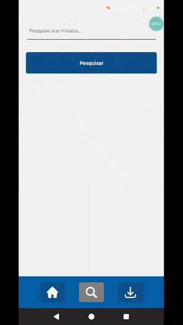
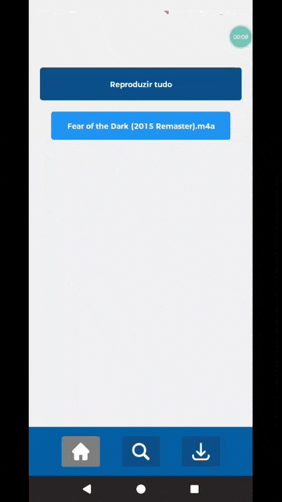

## Download

Para dispositivos antigos:

---

# Disquet

O **Disquet** é um player de música simples, gratuito e focado em resolver um problema direto: baixar músicas e reproduzi-las offline de forma rápida e prática.

---

## Objetivo do projeto

Este projeto foi desenvolvido como estudo, mas com foco em resolver um problema real do dia a dia:  
ter um player simples que permita baixar e ouvir músicas offline sem complicação.

---

## Funcionalidades

- Reprodução de músicas  
- Pausar músicas  
- Reprodução em segundo plano  
- Download de músicas via link
- Pesquisar músicas dentro do app
- Barra de progresso durante o download  

## Tecnologias utilizadas

- **React Native**
- **TypeScript**
- **Kotlin**
- **Android SDK CLI**

Todo o processamento é feito localmente (sem backend).

---

## Plataforma

Atualmente disponível apenas para:

- Android

---

## Como usar

### Pesquise e baixe.

Pesquise a música que você deseja baixar. Quando a pesquisa for finalizada, aparecerá 10 resultados.

Por enquanto pode haver somente um download por vez e qualquer tentativa de baixar mais de uma música, será barrada pelo disquet.

Quando o disquet é iniciado pela primeira vez, ele cria uma pasta na raíz do armazenamento do seu dispositivo. Todas as músicas baixadas através do disquet serão salvas nessa pasta, caso você tenha uma música que foi baixada de outra forma, você pode mover o arquivo para essa pasta e o disquet vai poder exibir ela junto com as demais músicas salvas na página home.

### Clique e reproduza

Na página de home(representada por um ícone de casa) aparecerá todas as músicas que você baixou através do disquet.

---

## Guia de contribuição

[Guia de contribuição](./docs/CONTRIBUTING.md)

---

## Ícones usados:

home: https://www.flaticon.com/free-icon/home_1946436?term=home&page=1&position=4&origin=search&related_id=1946436

search: https://www.flaticon.com/free-icon/magnifying-glass_151773?term=search&page=1&position=3&origin=search&related_id=151773

download: https://www.flaticon.com/free-icon/downloads_7268609?term=download&page=1&position=2&origin=search&related_id=7268609